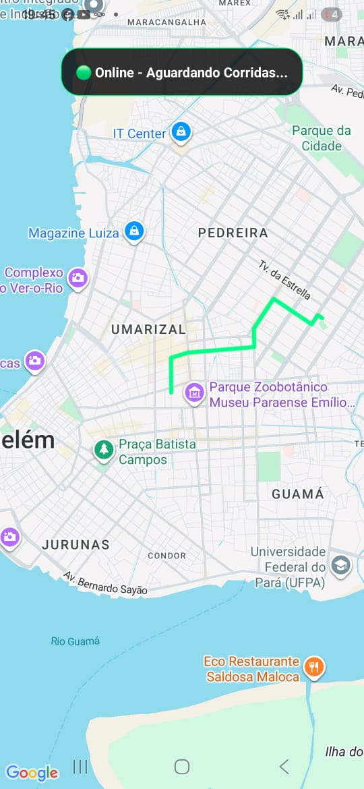
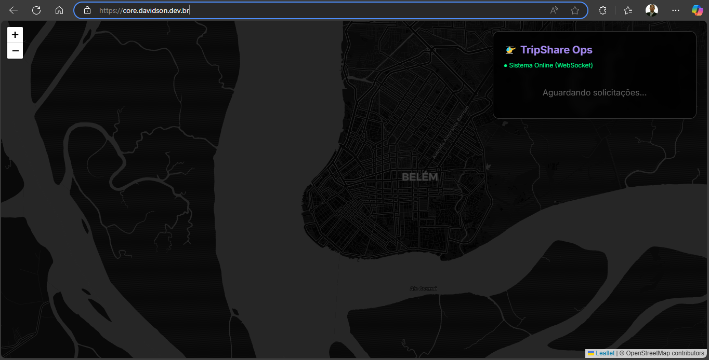
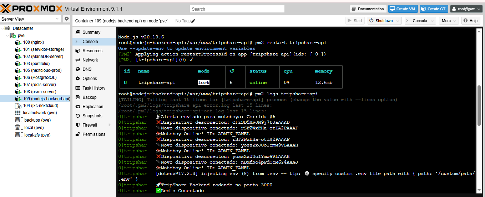

# 📱 TripShare Mobile

> **Aplicativo de Mobilidade Urbana em Tempo Real (React Native + Expo).**

Este é o cliente mobile do ecossistema **TripShare**. Ele se conecta ao backend de microsserviços para solicitar corridas, calcular rotas e receber despachos em tempo real via WebSockets.

---

## 📱 Galeria do App Mobile

<table>
  <tr>
    <td align="center"><b>Rota no Mapa</b></td>
  </tr>
  <tr>
    <td>
      
    </td>
  </tr>
</table>

## 🖥️ Painel de Controle (Web)





---

## 🛠️ Tecnologias

* **React Native** (Framework UI)
* **Expo** (Build & Dev Tools)
* **Socket.io Client** (Comunicação Real-Time Bidirecional)
* **React Native Maps** (Visualização Geoespacial)
* **Vibration API** (Feedback háptico para alertas)

---

## ⚙️ Funcionalidades

* 📍 **Geolocalização:** Mostra posição atual e desenha rotas no mapa.
* ⚡ **Real-Time:** Recebe alertas de novas corridas instantaneamente (sem refresh).
* 🗺️ **Rotas OSRM:** Renderiza a geometria exata da rota (Polyline) vinda do backend.
* 📳 **Alertas:** Toca som e vibra o celular quando uma corrida é ofertada.

---

## 🚀 Como Rodar

### Pré-requisitos
* Node.js instalado.
* Celular com o app **Expo Go** (Android/iOS) ou Emulador.

### Instalação

```bash
# 1. Clone o repositório
git clone [https://github.com/davidsoncabista/tripshare-mobile.git](https://github.com/davidsoncabista/tripshare-mobile.git)
cd tripshare-mobile

# 2. Instale as dependências
npm install

# 3. Execute o projeto
npx expo start
```

### Configuração de Rede
O app está configurado para apontar para o Gateway do TripShare:
> **URL da API:** `https://core.davidson.dev.br`

Se estiver rodando o backend localmente, altere a variável `SOCKET_URL` em `App.js`.

---

Developed with 💜 by **Davidson**.